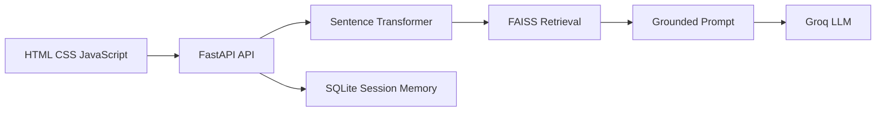

# Inquisitors AI Assistant - Presentation

## Slide 1 - Project Overview

The Inquisitors AI Assistant is a knowledge-grounded chatbot for students
and visitors who need verified information about the Inquisitors Society.

## Slide 2 - Problem and Users

Target users are students, prospective members, internship applicants,
event participants, staff, and visitors seeking official contact details.

The chatbot reduces repeated questions while keeping unsupported topics out
of scope.

## Slide 3 - Supported Topics

- Society introduction and departments
- Membership and registration guidance
- Internships and application guidance
- Events, workshops, competitions, and training
- Services, FAQs, contact details, and official channels

## Slide 4 - Architecture



## Slide 5 - RAG Pipeline

1. Validate the user's message.
2. Embed the question with `all-MiniLM-L6-v2`.
3. Retrieve the closest knowledge chunks from FAISS.
4. Reject irrelevant results with a distance threshold.
5. Build a prompt containing only verified context.
6. Generate and store the grounded response.

## Slide 6 - User Experience

- Responsive browser-based chat interface
- Suggested questions for first-time users
- Session persistence through LocalStorage and SQLite
- Clickable official URLs in responses
- Human support button with phone and social channels
- Friendly fallback for unsupported questions

## Slide 7 - Demonstration Walkthrough

1. Open `frontend/index.html` through the local frontend server.
2. Select “What is Inquisitors?” from the suggested questions.
3. Ask a follow-up about membership registration.
4. Ask for official social-media links and open a returned URL.
5. Ask an unrelated question and show the grounded fallback.
6. Select “Contact Support” to show escalation information.

## Slide 8 - API Contract

- `POST /api/chat` sends a message and returns an answer, sources, and session ID.
- `GET /api/history/{session_id}` returns saved messages.
- `DELETE /api/history/{session_id}` clears one conversation.
- `GET /health` reports service health.

## Slide 9 - Testing

- 40 documented scenario cases in `test/test_cases.csv`.
- Automated tests cover prompt grounding, source extraction, relevance,
  request validation, chat responses, and fallback handling.
- Focused automated suite: 7 tests passing without external API calls.

## Slide 10 - Security and Boundaries

- API keys are loaded from `.env` and excluded from Git.
- Pydantic validates message size and session IDs.
- Frontend escapes model output before rendering formatting.
- The assistant does not invent registration links or unsupported facts.
- Out-of-scope questions receive a clear fallback.

## Slide 11 - Deployment

```text
pip install -r requirements.txt
uvicorn app.main:app --reload --host 127.0.0.1 --port 8000
cd frontend
python -m http.server 8080
```

The repository includes the processed knowledge base and rebuilt FAISS
metadata. A valid `GROQ_API_KEY` is required for live answers.

## Slide 12 - Future Work

- Authentication and role-based administration
- Analytics dashboard with privacy controls
- Multilingual and voice interfaces
- Direct integration with official application data
- Automated knowledge-base update workflow