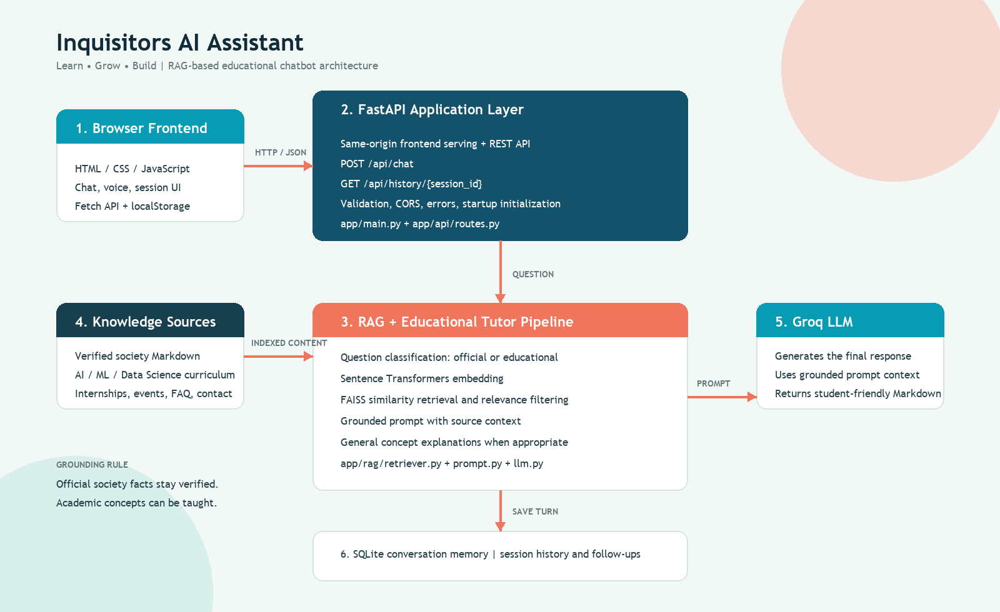
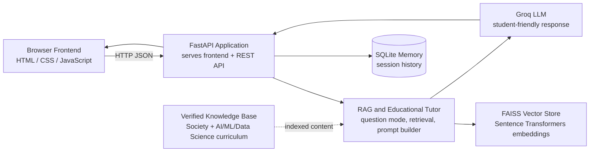

# Inquisitors Chatbot - System Architecture

**Project:** Inquisitors AI Assistant  
**Version:** 1.0.0  
**Date:** 2024-08-20  

---

## 1.1 Current Architecture Diagram

The current system serves the frontend and FastAPI API from one local or
hosted origin. Educational questions can use the tutor mode, while official
Inquisitors Society facts remain grounded in verified knowledge-base content.



### Mermaid Version




The standalone image is also available at
`screenshots/system-architecture.png` for use in presentation slides or a
PDF report. The editable vector source is `screenshots/system-architecture.svg`.

---

## 1. Architecture Overview

```
┌─────────────────────────────────────────────────────────┐
│                    USER INTERFACE                       │
│         (HTML/CSS/JavaScript - Browser)                 │
└──────────────────────┬──────────────────────────────────┘
                       │ HTTP/JSON
                       ↓
┌──────────────────────────────────────────────────────────┐
│                   FASTAPI BACKEND                        │
│  ├─ Routing          (app/api/routes.py)                │
│  ├─ Request Handler  (app/api/chat.py)                  │
│  ├─ Validation       (Pydantic models)                   │
│  └─ Middleware       (CORS, error handling)              │
└──────────────┬───────────────────────────┬───────────────┘
               │                           │
               ↓                           ↓
    ┌──────────────────────┐   ┌──────────────────────┐
    │   RAG PIPELINE       │   │  CONVERSATION MEMORY │
    │  (app/rag/)          │   │  (SQLite Database)   │
    ├─ Retriever          │   └──────────────────────┘
    ├─ Vector Store       │
    ├─ Embeddings         │
    ├─ Prompt Builder     │
    └─ LLM Integration    │
         │
         ├─→ FAISS Index (vector_store/)
         ├─→ Sentence Transformers (embeddings)
         ├─→ Knowledge Base (knowledge_base/processed/)
         └─→ Groq LLM API (external)
```

---

## 2. Component Architecture

### 2.1 Frontend Layer

**Location:** `frontend/`

**Components:**
- `index.html` - Main page structure
- `script.js` - Chat logic and API communication
- `style.css` - Styling and responsive design
- `assets/` - Logo and images

**Responsibilities:**
- Display chat interface
- Handle user input
- Send messages to backend
- Display responses
- Manage session storage
- Handle errors

**Technology:**
- Vanilla JavaScript (ES6+)
- LocalStorage for session persistence
- Fetch API for HTTP requests
- CSS Grid for responsive layout

---

### 2.2 API Gateway Layer

**Location:** `app/main.py`

**Responsibilities:**
- Initialize FastAPI application
- Configure CORS middleware
- Register routers
- Handle startup/shutdown
- Initialize RAG components

**Configuration:**
```python
app = FastAPI(
    title="Inquisitors AI Assistant",
    version="1.0.0"
)

app.add_middleware(
    CORSMiddleware,
    allow_origins=["*"],
    allow_credentials=True,
    allow_methods=["*"],
    allow_headers=["*"]
)
```

---

### 2.3 API Routes Layer

**Location:** `app/api/routes.py` and `app/api/chat.py`

**Endpoints:**
- `POST /api/chat` - Send message and get response
- `GET /api/history/{session_id}` - Retrieve conversation
- `DELETE /api/history/{session_id}` - Clear conversation

**Features:**
- Input validation (Pydantic)
- Session management
- RAG component initialization
- Error handling
- Response formatting

**Flow:**
```
Request → Validation → RAG Pipeline → SQLite Storage → Response
```

---

### 2.4 RAG Pipeline Layer

**Location:** `app/rag/`

#### 2.4.1 Retriever Module (`retriever.py`)

**Responsibilities:**
- Load FAISS vector index
- Load embedding model
- Perform similarity search
- Check relevance

**Functions:**
- `load_vector_store()` - Load FAISS index and chunks
- `load_model()` - Load Sentence Transformers model
- `retrieve(query, model, index, chunks, top_k=3)` - Search
- `is_relevant(results)` - Check relevance threshold

**Process:**
```
User Query → Embed with Sentence Transformers 
          → Search FAISS (top-3)
          → Score similarity
          → Return results
```

#### 2.4.2 Vector Store Module (`vector_store.py`)

**Responsibilities:**
- Manage FAISS index creation
- Handle index persistence
- Chunk metadata management

**Key Functions:**
- `build_index(texts, embeddings)` - Create index
- `save_index(index, path)` - Persist to disk
- `load_index(path)` - Load from disk

**Storage:**
- `vector_store/inquisitors.index` - FAISS binary index
- Chunks metadata embedded in index

#### 2.4.3 Embeddings Module (`embeddings.py`)

**Responsibilities:**
- Generate embeddings for text
- Handle embedding model loading
- Batch processing support

**Model:** `sentence-transformers/all-MiniLM-L6-v2`

**Specifications:**
- Dimension: 384
- Type: Dense vectors
- Speed: ~1000 texts/sec
- Memory: ~300MB

#### 2.4.4 LLM Module (`llm.py`)

**Responsibilities:**
- Create Groq API client
- Generate responses
- Handle API communication
- Manage conversation context

**Model:** `openai/gpt-oss-20b`

**Features:**
- Groq API integration
- Streaming support
- Error handling
- Rate limiting ready

**Functions:**
- `create_client()` - Initialize Groq client
- `generate_response(user_question, rag_prompt, client, session_id)` - Generate answer

#### 2.4.5 Prompt Module (`prompt.py`)

**Responsibilities:**
- Build RAG prompts
- Extract sources
- Format context for LLM

**Components:**
- `SYSTEM_PROMPT` - Instructions for LLM
- `build_prompt(question, results)` - Create RAG prompt
- `get_sources(results)` - Extract source file names

**Prompt Structure:**
```
[System Instructions]
- Rules for grounding
- Knowledge-only responses
- No hallucination

[User Question]
{question}

[Knowledge Context]
{retrieved_chunks}

[Generation]
Please answer based on the knowledge provided...
```

#### 2.4.6 Loader Module (`loader.py`)

**Responsibilities:**
- Load markdown knowledge files
- Create text chunks
- Generate embeddings
- Build and save FAISS index

**Process:**
```
1. Read all .md files from knowledge_base/processed/
2. Split into chunks (500 chars, 100 overlap)
3. Generate embeddings via Sentence Transformers
4. Create FAISS index
5. Save to vector_store/inquisitors.index
6. Cache model locally
```

**Execution:** One-time setup via `python -m app.rag.loader`

#### 2.4.7 Chunker Module (`chunker.py`)

**Responsibilities:**
- Split long documents into chunks
- Maintain chunk metadata
- Preserve context

**Algorithm:**
```
Document → Paragraphs → Sentences → Chunks
                          ↓
                    Sliding window
                    (500 chars, 100 overlap)
```

#### 2.4.8 Memory Module (`memory.py`)

**Responsibilities:**
- SQLite database operations
- Message storage/retrieval
- Session management

**Functions:**
- `add_message(session_id, role, content)` - Store message
- `get_history(session_id)` - Retrieve conversation
- `clear_history(session_id)` - Delete conversation

---

### 2.5 Data Storage Layer

**Location:** `data/`

#### 2.5.1 SQLite Database

**File:** `data/chatbot.db`

**Schema:**
```sql
CREATE TABLE conversations (
    id INTEGER PRIMARY KEY AUTOINCREMENT,
    session_id TEXT NOT NULL,
    role TEXT NOT NULL,  -- 'user' or 'assistant'
    content TEXT NOT NULL,
    timestamp DATETIME DEFAULT CURRENT_TIMESTAMP
);

CREATE INDEX idx_session ON conversations(session_id);
```

**Capabilities:**
- Persistent storage of all conversations
- Fast retrieval by session_id
- Indexed queries
- ACID compliance

#### 2.5.2 Vector Store

**File:** `vector_store/inquisitors.index`

**Format:** FAISS binary index

**Properties:**
- Flat index (exhaustive search)
- 384-dimensional vectors
- ~10,000+ vectors (11 KB documents × ~900 chunks)
- Distance metric: L2 (Euclidean)

---

### 2.6 Knowledge Base Layer

**Location:** `knowledge_base/processed/`

**Documents:**

| File | Purpose | Size |
|------|---------|------|
| society.md | Society overview | ~2KB |
| departments.md | Organization structure | ~3KB |
| membership.md | Membership details | ~2.5KB |
| internships.md | Internship programs | ~4KB |
| events.md | Events and competitions | ~3.5KB |
| training.md | Training programs | ~2KB |
| services.md | Services offered | ~1.5KB |
| faq.md | Frequently asked questions | ~2KB |
| contact.md | Contact information | ~1KB |
| social_media.md | Social media handles | ~0.5KB |
| sources.md | References | ~1KB |

**Format:** Markdown (.md) with:
- Headers (# ## ###)
- Paragraphs
- Lists and bullet points
- Metadata comments

**Total Size:** ~27KB (compressed to ~10KB tokens)

---

## 3. Data Flow Diagrams

### 3.1 Message Processing Flow

```
┌──────────────────┐
│  User Types Text │
└────────┬─────────┘
         │
         ↓
┌──────────────────────────┐
│ Frontend Validation      │
│ - Not empty              │
│ - < 4000 chars           │
└────────┬─────────────────┘
         │
         ↓
┌──────────────────────────┐
│ JSON Request             │
│ {message, session_id}    │
└────────┬─────────────────┘
         │ HTTP POST /api/chat
         ↓
┌──────────────────────────┐
│ Backend Validation       │
│ - Pydantic validation    │
│ - String sanitization    │
└────────┬─────────────────┘
         │
         ↓
┌──────────────────────────┐
│ RAG Pipeline Start       │
└────────┬─────────────────┘
         │
    ┌────┴────┐
    │ → RETRIEVE
    │    Query embedded via Sentence Transformers
    │    Top-3 similar docs from FAISS
    │ → RELEVANCE CHECK
    │    Similarity score > threshold?
    │ → BUILD PROMPT
    │    Combine question + knowledge context
    │ → GENERATE RESPONSE
    │    Call Groq LLM API
    │
    ↓
┌──────────────────────────┐
│ Save to SQLite           │
│ - User message           │
│ - Assistant response     │
└────────┬─────────────────┘
         │
         ↓
┌──────────────────────────┐
│ JSON Response            │
│ {answer, sources}        │
└────────┬─────────────────┘
         │ HTTP 200
         ↓
┌──────────────────────────┐
│ Frontend Display         │
│ - Show answer            │
│ - Update chat            │
│ - Save session_id        │
└──────────────────────────┘
```

### 3.2 Knowledge Retrieval Flow

```
User Question
    │
    ↓ Sentence Transformers
┌─────────────────────┐
│ Query Embedding     │
│ (384-dim vector)    │
└────────┬────────────┘
         │
         ↓ FAISS Search
┌─────────────────────┐
│ Similarity Search   │
│ (top-3 results)     │
└────────┬────────────┘
         │
    ┌────┴────────────────┐
    │                     │
    ↓                     ↓
[Result1]           [Result2]
Score: 0.85         Score: 0.78
Source: faq.md      Source: events.md
Text: "..."         Text: "..."
         │                     │
         └────────┬────────────┘
                  ↓
         ┌─────────────────────┐
         │ Relevance Filter    │
         │ All scores > 0.5?   │
         │ Use for prompt      │
         └──────────┬──────────┘
                    │
                    ↓
            [Filtered Results]
            For RAG prompt
```

### 3.3 Startup Sequence

```
Application Start
    │
    ├─→ Load FAISS Index
    │   └─→ vector_store/inquisitors.index
    │       └─→ Chunks metadata
    │
    ├─→ Load Embedding Model
    │   └─→ Sentence Transformers
    │       └─→ Cached locally
    │
    ├─→ Create Groq Client
    │   └─→ API key from .env
    │       └─→ Validation check
    │
    ├─→ Initialize SQLite
    │   └─→ data/chatbot.db
    │       └─→ Create tables if needed
    │
    └─→ Register API Routes
        └─→ FastAPI ready
            └─→ Listen on 8000

Application Ready
```

---

## 4. Deployment Architecture

### 4.1 Local Development

```
Developer Machine
├─ VS Code/IDE
├─ Python 3.9+
├─ Git repository
├─ FastAPI (localhost:8000)
├─ SQLite (local file)
├─ FAISS index (local file)
└─ Browser (frontend)
```

### 4.2 Single Server Deployment

```
┌─────────────────────────────────────┐
│        Production Server            │
├─────────────────────────────────────┤
│                                     │
│  ┌─────────────────────────────┐   │
│  │   Nginx (Reverse Proxy)     │   │
│  │   Port 80/443               │   │
│  └──────────────┬──────────────┘   │
│                 │                  │
│  ┌──────────────↓──────────────┐   │
│  │   Gunicorn (WSGI Server)    │   │
│  │   Port 8000 (internal)      │   │
│  │   4-8 workers               │   │
│  └──────────────┬──────────────┘   │
│                 │                  │
│  ┌──────────────↓──────────────┐   │
│  │   FastAPI Application       │   │
│  │   - API endpoints           │   │
│  │   - RAG pipeline            │   │
│  │   - Error handling          │   │
│  └──────────────┬──────────────┘   │
│                 │                  │
│    ┌────────────┼────────────┐    │
│    │            │            │    │
│    ↓            ↓            ↓    │
│  ┌──┐       ┌──────┐    ┌──────┐  │
│  │DB│       │FAISS │    │Cache │  │
│  └──┘       └──────┘    └──────┘  │
│                                    │
└────────────────────────────────────┘
         ↑                    ↑
    [Browser]           [Users]
```

### 4.3 Scalable Deployment

```
┌─────────────────────────────────────┐
│         Load Balancer               │
│     (Nginx/HAProxy)                 │
└──────────┬──────────────────────────┘
           │
    ┌──────┼──────┐
    │      │      │
    ↓      ↓      ↓
  ┌──┐  ┌──┐  ┌──┐
  │App1  App2  App3  ┌─ Multiple FastAPI instances
  │ 8001│ 8002│ 8003 │
  └──┘  └──┘  └──┘
    │      │      │
    └──────┼──────┘
           │ (Shared)
    ┌──────↓──────────┐
    │  SQLite File    │
    │  (Locked)       │
    └─────────────────┘

Note: FAISS index cached in memory for each instance
```

---

## 5. Database Schema

### 5.1 Conversations Table

```sql
CREATE TABLE conversations (
    id INTEGER PRIMARY KEY AUTOINCREMENT,
    session_id TEXT NOT NULL,
    role TEXT NOT NULL CHECK(role IN ('user', 'assistant')),
    content TEXT NOT NULL,
    timestamp DATETIME DEFAULT CURRENT_TIMESTAMP
);

CREATE INDEX idx_session_id ON conversations(session_id);
CREATE INDEX idx_session_timestamp ON conversations(session_id, timestamp);
```

### 5.2 Query Examples

```sql
-- Get conversation history
SELECT role, content, timestamp FROM conversations 
WHERE session_id = 'web-123-abc'
ORDER BY timestamp ASC;

-- Clear conversation
DELETE FROM conversations WHERE session_id = 'web-123-abc';

-- Get latest message
SELECT content FROM conversations 
WHERE session_id = 'web-123-abc'
ORDER BY timestamp DESC LIMIT 1;
```

---

## 6. Error Handling Strategy

```
Request
  │
  ├─ Validation Error
  │  └─→ 400 Bad Request + message
  │
  ├─ RAG Initialization Error
  │  └─→ 503 Service Unavailable
  │
  ├─ FAISS Retrieval Error
  │  └─→ 500 Server Error + log
  │
  ├─ LLM API Error
  │  ├─ Rate limit → Queue retry
  │  ├─ Auth fail → 500 error
  │  └─ Timeout → 504 Gateway Timeout
  │
  ├─ SQLite Error
  │  └─→ 500 Server Error + log
  │
  └─ Unknown Error
     └─→ 500 Server Error + generic message

All errors logged for debugging
```

---

## 7. Security Architecture

### 7.1 Input Security

```
User Input
  │
  ├─ Pydantic Validation
  │  ├─ Type checking
  │  ├─ Length validation (max 4000)
  │  └─ Required field validation
  │
  └─ Sanitization
     ├─ .strip() whitespace
     ├─ No script injection
     └─ SQL injection prevention
```

### 7.2 API Security

```
Request
  │
  ├─ CORS middleware (origin verification)
  ├─ No auth required (public API)
  ├─ Rate limiting ready
  └─ HTTPS recommended
```

### 7.3 Data Security

```
Sensitive Data
  │
  ├─ API Keys → .env file (not in code)
  ├─ Passwords → Not stored
  ├─ PII → Not stored
  └─ Logs → No sensitive data
```

---

## 8. Performance Optimization

### 8.1 Caching Strategy

```
FAISS Index
  ├─ Loaded once at startup
  ├─ Kept in memory
  └─ Immutable (no real-time updates)

Embedding Model
  ├─ Loaded once at startup
  ├─ Reused for all requests
  └─ Sentence Transformers cached

LLM Model
  ├─ Hosted by Groq (not local)
  ├─ API calls cached in prompt
  └─ No local storage needed
```

### 8.2 Query Optimization

```
FAISS Search
  ├─ O(log n) search time
  ├─ Flat index (exhaustive)
  ├─ Top-3 results only
  └─ ~100ms per query

Embedding Generation
  ├─ Batching support
  ├─ GPU acceleration available
  └─ ~100ms for single query
```

---

## 9. Monitoring & Logging

### 9.1 Log Points

```
Application Start
  ├─ RAG component initialization
  ├─ Model loading status
  └─ Server startup confirmation

Each Request
  ├─ Request received (timestamp)
  ├─ Session ID tracking
  ├─ Query embedding time
  ├─ Retrieval time
  ├─ LLM response time
  └─ Response sent

Errors
  ├─ Error type
  ├─ Timestamp
  ├─ Session context
  └─ Stack trace
```

### 9.2 Metrics to Track

```
Performance
  ├─ Average response time
  ├─ P95 response time
  ├─ Queries per minute
  └─ Memory usage

Quality
  ├─ Fallback rate
  ├─ Error rate
  ├─ Session duration
  └─ Conversation length
```

---

## 10. Scalability Considerations

### 10.1 Current Limitations

- Single process handles all requests
- SQLite concurrent write limiting
- FAISS index loaded in RAM
- No distributed caching

### 10.2 Future Scaling

```
To scale:
├─ Multiple FastAPI workers (Gunicorn)
├─ PostgreSQL for persistence
├─ Redis for caching
├─ Kubernetes orchestration
├─ Distributed FAISS (Index Server)
└─ LLM load balancing
```

---

## Conclusion

The Inquisitors Chatbot architecture is designed for:
- ✅ Simplicity (single server)
- ✅ Reliability (error handling)
- ✅ Performance (optimized pipeline)
- ✅ Security (input validation)
- ✅ Scalability (preparation for growth)

The RAG pipeline ensures knowledge-grounded responses while the modular design allows easy maintenance and future enhancements.
